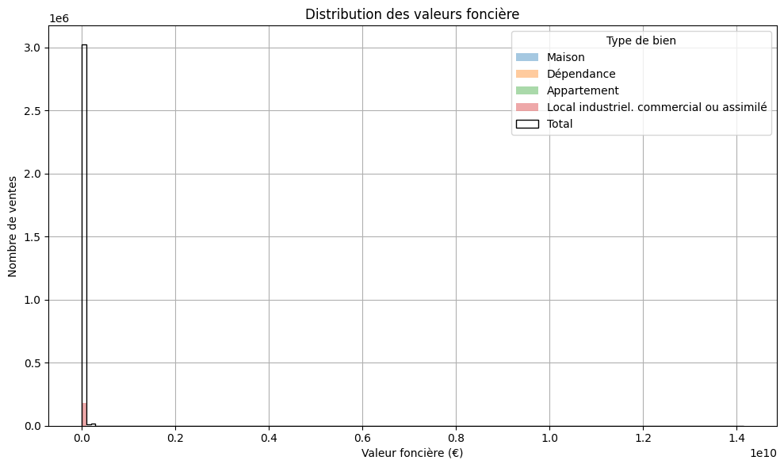
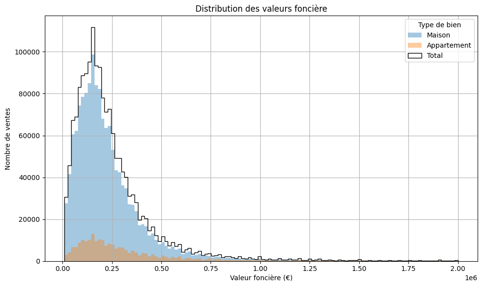
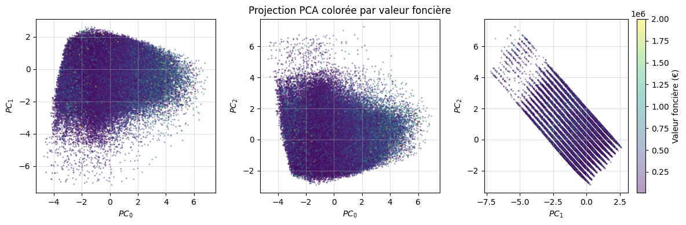
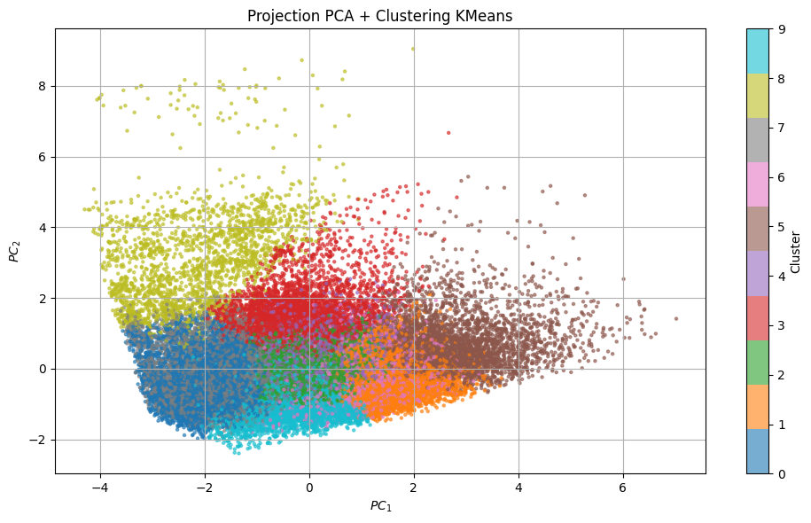

# Prédiction de la valeur foncière à partir des données DVF

Projet réalisé en **Master 1 Physique Appliquée**, dans le cadre de l’UE
**Méthodes de Machine Learning (MML)** à **l’Université Paris Cité**,
année universitaire 2024–2025.

**Auteurs :** Eloi Raad

**Support de soutenance :**
[Soutenance.pdf](Soutenance.pdf)

## Objectif

Ce projet étudie la prédiction de la valeur d’un bien immobilier à partir
des données ouvertes **Demandes de valeurs foncières (DVF)** de la DGFiP.
Le travail couvre toute la chaîne d’analyse : exploration, nettoyage,
construction de variables, réduction de dimension, clustering, régression
et combinaison de modèles.

L’analyse conservée dans le notebook utilise les données de 2019 à 2021. Une exécution sauvegardée charge 10 162 527 lignes brutes et
retient environ 1,68 million de ventes résidentielles après filtrage, avant
échantillonnage pour l’entraînement.

## Travail réalisé

### 1. Chargement et nettoyage

Les fichiers annuels DVF sont concaténés, puis les observations sont filtrées
pour obtenir un marché résidentiel cohérent :

- nature de mutation : `Vente` ;
- types de locaux : `Maison` et `Appartement` ;
- valeur foncière comprise entre 10 000 € et 2 000 000 € ;
- surface bâtie comprise entre 10 m² et 300 m² ;
- surface du terrain inférieure ou égale à 1 000 m² ;
- nombre de pièces principales compris entre 1 et 12 ;
- suppression des lignes incomplètes sur les variables utilisées.

Ce filtrage retire les valeurs aberrantes, les ventes non résidentielles et
les observations insuffisamment renseignées.

| Distribution brute | Distribution après filtrage |
|:---:|:---:|
|  |  |

### 2. Variables et préparation

Les variables explicatives retenues sont :

- code du département et type de local ;
- surface du terrain et surface réelle bâtie ;
- nombre de pièces principales ;
- mois de la vente ;
- fréquence d’apparition du code postal.

Le prix au m² est calculé pour l’analyse exploratoire, mais n’est pas utilisé
comme variable prédictive puisqu’il dépend directement de la cible. Les
variables numériques sont standardisées, les variables catégorielles sont
encodées par one-hot encoding et la valeur foncière est transformée avec
`log1p`. Les données sont ensuite séparées en ensembles
d’entraînement, de validation et de test.

### 3. PCA et clustering

Une analyse en composantes principales (PCA) étudie la réduction du nombre de
dimensions engendré par l’encodage. Environ cinq à six composantes expliquent
plus de 80 % de la variance. Une exécution de la Random Forest avec
PCA atteint `R² ≈ 0,1465`, tandis qu’une autre exécution sans PCA atteint
`R² = 0,6410`. Les états d’exécution et tailles d’échantillon diffèrent : cet
écart n’est pas une comparaison contrôlée, mais l’étude retient qualitativement
les variables non projetées pour la suite.

Un clustering K-means à dix groupes est également exploré. Les groupes obtenus
restent difficiles à interpréter en profils immobiliers distincts ; cette
piste n’est donc pas réutilisée dans les modèles supervisés finaux.

| Projection PCA colorée par valeur foncière | Projection PCA des clusters K-means |
|:---:|:---:|
|  |  |

### 4. Modèles supervisés et hybridation

Deux familles principales sont comparées :

- **Random Forest**, adaptée aux relations non linéaires et aux données
  tabulaires hétérogènes ;
- **MLP et ResMLP**, réseaux denses utilisant notamment normalisation,
  dropout, connexions résiduelles, arrêt anticipé et réduction du taux
  d’apprentissage.

Trois combinaisons RF–MLP sont ensuite testées :

1. moyenne pondérée des deux prédictions ;
2. apprentissage par le MLP des résidus de la Random Forest ;
3. enrichissement des variables du MLP avec la prédiction de la Random Forest.

## Résultats sauvegardés

| Modèle | MAE | RMSE | R² |
|---|---:|---:|---:|
| Random Forest | 74 100,50 € | 130 296,48 € | 0,6410 |
| MLP | 87 981,16 € | 157 344,16 € | 0,4765 |
| Moyenne RF + MLP (figure exportée) | 74 100,50 € | 130 296,48 € | 0,6410 |
| Correction par résidus | **72 944,85 €** | **128 588,45 €** | **0,6504** |
| Enrichissement | 75 313,40 € | 131 265,95 € | 0,6357 |

La Random Forest constitue le meilleur modèle simple. Le MLP seul obtient des
performances inférieures. La correction par résidus apporte le meilleur
résultat sauvegardé, mais le gain par rapport à la Random Forest reste faible.
La moyenne pondérée et l’enrichissement n’améliorent pas nettement la référence.

| Random Forest | Random Forest corrigée par un MLP entraîné sur ses résidus |
|:---:|:---:|
|  |  |

## Données

Les données ne sont pas versionnées dans ce dépôt en raison de leur volume.
Elles proviennent du jeu officiel
[Demandes de valeurs foncières](https://www.data.gouv.fr/datasets/demandes-de-valeurs-foncieres)
publié par la DGFiP.

Créer un dossier local `data/` à la racine, puis y placer les
fichiers historiques attendus par le notebook :

```text
data/
├── ValeursFoncieres-2019-S2.txt
├── ValeursFoncieres-2020.txt
└── ValeursFoncieres-2021.txt
```

## Installation et exécution


```bash
python3.11 -m venv .venv
source .venv/bin/activate
python -m pip install --upgrade pip
python -m pip install -r requirements.txt
jupyter lab Projet.ipynb
```

Le chargement de plus de dix millions de lignes demande beaucoup de mémoire.
Selon les expériences, les modèles utilisent le jeu filtré complet ou des
échantillons de 100 000 à 500 000 observations.
Un GPU accélère l’entraînement des réseaux de neurones, mais n’est pas requis
pour ouvrir et parcourir le notebook.

## Structure du dépôt

```text
.
├── .gitignore
├── Projet.ipynb
├── README.md
├── requirements.txt
├── Soutenance_RAAD_Bensadok.pdf
├── data/                         # à créer localement, ignoré par Git
└── images/                       # figures exploratoires et résultats
```

`Projet.ipynb` constitue l’analyse principale. Le PDF contient le
support de soutenance et `images/` conserve l’ensemble des figures
produites pendant le projet.

## Limites et perspectives

- chargement en mémoire coûteux et données sources absentes du dépôt ;
- résultats sensibles aux tirages aléatoires et à l’échantillonnage ;
- localisation limitée principalement au département et à la fréquence du
  code postal ;
- PCA peu adaptée à la Random Forest dans cette configuration ;
- clusters K-means peu interprétables ;
- hyperparamètres explorés sur un espace limité.

Les pistes identifiées sont l’ajout de données socio-économiques et
géographiques, une validation croisée mieux contrôlée, des modèles de boosting,
un clustering plus adapté et une optimisation plus systématique des modèles
hybrides.
